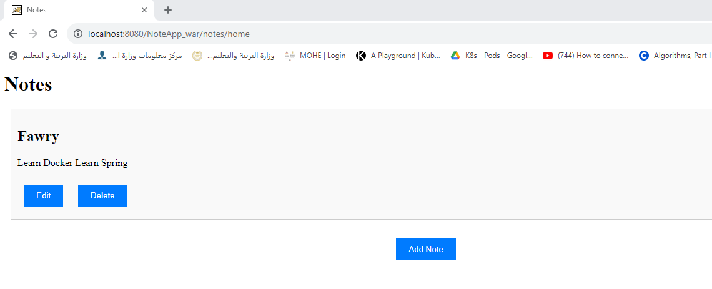

# Note App



## Table of Contents

- [Description](#description)
- [Technologies Used](#technologies-used)
- [Project Structure](#project-structure)

## Description

This is a simple note app that allows you to create, edit, and delete notes. It is built using Java EE, Hibernate, and MySQL.

## Technologies Used

- Jakarta EE
- Hibernate (ORM) with MySQL
- Servlets
- JSP
- Clean Architecture (Entities -> Repositories -> Services -> Servlets)
- maven
- Tomcat

## Project Structure

```
├───.idea
│   ├───artifacts
│   └───libraries
├───src
│   ├───main
│   │   ├───java
│   │   │   └───com
│   │   │       └───example
│   │   │           └───noteapp
│   │   │               ├───rest
│   │   │               ├───entity
│   │   │               ├───repository
│   │   │               ├───service
│   │   │               └───App
│   │   └───webapp
│   │       ├───META-INF
│   │       └───WEB-INF
│   └───test
│       └───java
│           └───com
│               └───example
│                   └───noteapp

```